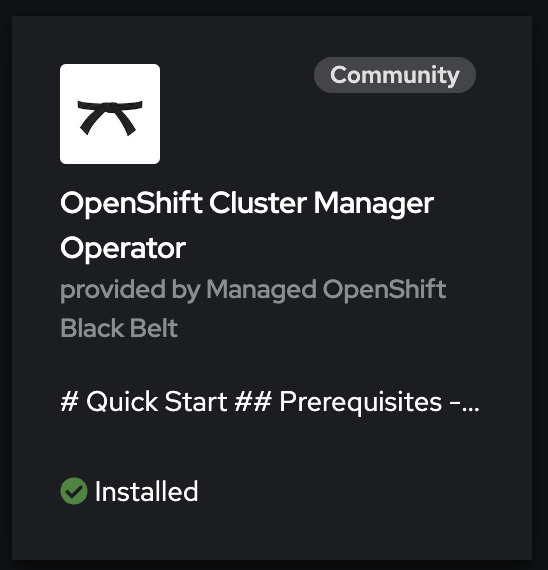
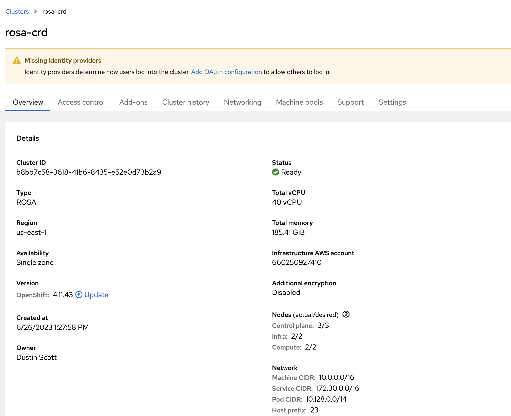
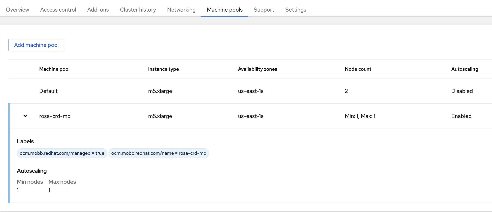

Many organizations want to use GitOps methodologies as a main part of their operational practices.  Often times, this 
includes infrastructure as well.  The advantage to this practice is that anything controlled 
in this manner can exist as infrastructure-as-code, by way of Kubernetes YAML definitions, in a 
centralized repository backed by Git.  Additionally, all processes and procedures become a part of the Git 
workflow with a standardized Continuous Deployment pipeline controlling the outcome.  ROSA is not immune 
to these practices, however, there was not a native way to control ROSA clusters with 
Kubernetes YAML definitions.  This struck up a community project called [OCM Operator](https://github.com/rh-mobb/ocm-operator) 
as a way to accomplish this.

This walkthrough takes a standard approach by first showing a user how to use the native [OCM Operator](https://github.com/rh-mobb/ocm-operator) CRDs and later 
guides a user that wants to use GitOps practices to control ROSA components such 
as Clusters, Machine Pools and Identity Providers.


## Prerequisites

* [ROSA Cluster](https://mobb.ninja/docs/rosa/sts/)
* [rosa](https://docs.openshift.com/rosa/rosa_cli/rosa-get-started-cli.html)
* [aws](https://docs.aws.amazon.com/cli/latest/userguide/install-cliv2.html)
* [oc](https://mirror.openshift.com/pub/openshift-v4/clients/ocp/)
* [jq](https://jqlang.github.io/jq/download/)


## Set Environment

This step sets needed environment variables that are necessary to continue the walkthrough:

* `AWS_ACCOUNT_ID`: the AWS account ID where the ROSA cluster will be provisioned.
* `ROSA_CLUSTER_NAME`: the ROSA cluster name that the OCM operator will be installed upon.
* `ROSA_USER_ROLE`: the [user role](https://docs.openshift.com/rosa/rosa_architecture/rosa-sts-about-iam-resources.html#rosa-sts-understanding-user-role_rosa-sts-about-iam-resources) 
that is associated with the cluster.  This is a mandatory input to the provisioning process.
* `OCM_OPERATOR_NAMESPACE`: the namespace where the ocm-operator will be installed.
* `OCM_OPERATOR_VERSION`: the version of ocm-operator that will be installed.

```bash
export AWS_ACCOUNT_ID=111111111111
export ROSA_CLUSTER_NAME=dscott
export ROSA_USER_ROLE="arn:aws:iam::${AWS_ACCOUNT_ID}:role/ManagedOpenShift-User-dscott_mobb-Role"
export OCM_OPERATOR_NAMESPACE=ocm-operator
export OCM_OPERATOR_VERSION=v0.1.0
```


## Install the OCM Operator


### Retrieve and Store the OCM Token

1. Create a namespace where you wish to install the operator:

```bash
oc new-project $OCM_OPERATOR_NAMESPACE
```

2. Create a secret containing the OCM_TOKEN.  This token can be obtained form 
https://console.redhat.com/openshift/token and is used by the operator to authenticate 
against the OCM API.  This token must exist in the same namespace that the operator 
is running and be named `ocm-token`.  It also expects the key to be called `OCM_TOKEN` 
as the operator is expecting this value as an environment variable.  **Be sure to 
substitute ${MY_OCM_TOKEN} with your token in the below command!**

```bash
oc create secret generic ocm-token \
  --namespace=$OCM_OPERATOR_NAMESPACE \
  --from-literal=OCM_TOKEN=${MY_OCM_TOKEN}
```


### Create the IAM Policies and Roles

The operator will need to elevate privileges in order to perform things like 
creating the operator-roles for the clusters.  Because of this, the operator 
must have a specific role created to allow it these permissions.  In each instance, 
it is a best practice to create a new set of policies and roles for each instance 
of the OCM Operator.  Policies and roles are prefixed with the `ROSA_CLUSTER_NAME` 
environment variable that is specified below.

**NOTE:** please understand what you are doing if you deviate from the known good 
policies.  If errors or more stringent security lockdowns are found, please submit a PR 
so that we can get this fixed.

1. Run the script to create the required policies and roles.  This creates a permission boundary, 
a policy for the operator, and a role which allows the operator to assume a role against the OIDC 
identity of the ROSA cluster.  If the policies and roles already exist (prefixed by your cluster 
name), then the creation of them is skipped:

```bash
curl -s https://raw.githubusercontent.com/rh-mobb/ocm-operator/main/test/scripts/generate-iam.sh | bash
```

2. Ceate the secret containing the assume role credentials:

```bash
cat <<EOF > /tmp/credentials
[default]
role_arn = arn:aws:iam::$AWS_ACCOUNT_ID:role/$ROSA_CLUSTER_NAME-OCMOperator
web_identity_token_file = /var/run/secrets/openshift/serviceaccount/token
EOF

oc create secret generic aws-credentials \
    --namespace=$OCM_OPERATOR_NAMESPACE \
    --from-file=credentials=/tmp/credentials
```


### Install the Operator

This step installs the OCM operator.  The OCM operator will use the OCM token 
from the previous step to authenticate against OCM, as well as your AWS 
credentials file to be able to assume the previous role you created in order 
to authenticate against the AWS API:

```bash
cat <<EOF | oc apply -f -
apiVersion: operators.coreos.com/v1
kind: OperatorGroup
metadata:
  name: ocm-operator
  namespace: $OCM_OPERATOR_NAMESPACE
spec:
  targetNamespaces:
    - $OCM_OPERATOR_NAMESPACE
---
apiVersion: operators.coreos.com/v1alpha1
kind: Subscription
metadata:
  name: ocm-operator
  namespace: $OCM_OPERATOR_NAMESPACE
spec:
  channel: alpha
  installPlanApproval: Automatic
  name: ocm-operator
  source: community-operators
  sourceNamespace: openshift-marketplace
  startingCSV: ocm-operator.$OCM_OPERATOR_VERSION
EOF
```

You have successfully installed the OCM operator, which now exists in OperatorHub!



## Provision a ROSA Cluster via Custom Resource Definition

- **Documentation**: `oc explain rosacluster.spec`
- **Examples**: https://github.com/rh-mobb/ocm-operator/tree/main/config/samples/cluster

This shows you how to install a ROSA Cluster directly via CRD.  This is important 
to understand the workflow and inputs to provisioning a cluster via GitOps.  You 
may safely [proceed to the GitOps provisioning step](#provision-objects-via-gitops) 
if you already understand this or would like to move directly to GitOps for provisioning 
objects.

```bash
cat << EOF | oc apply -f -
apiVersion: ocm.mobb.redhat.com/v1alpha1
kind: ROSACluster
metadata:
  name: rosa-crd
  namespace: $OCM_OPERATOR_NAMESPACE
spec:
  accountID: "${AWS_ACCOUNT_ID}"
  tags:
    owner: dscott
  iam:
    userRole: $ROSA_USER_ROLE
  defaultMachinePool:
    minimumNodesPerZone: 2
    instanceType: m5.xlarge
EOF
```

You can view the status of the cluster installation in [OCM](https://console.redhat.com).




## Provision a Machine Pool via Custom Resource Definition

- **Documentation**: `oc explain machinepool.spec`
- **Examples**: https://github.com/rh-mobb/ocm-operator/tree/main/config/samples/machinepool

This shows you how to install a ROSA Cluster Machine Pool directly via CRD.  This is important 
to understand the workflow and inputs to provisioning a cluster via GitOps.  You 
may safely [proceed to the GitOps provisioning step](#provision-objects-via-gitops) 
if you already understand this or would like to move directly to GitOps for provisioning 
objects.

> **IMPORTANT** This relies upon a fully operational ROSA cluster.  If you are following along 
and just [provisioned a ROSA cluster via CRD](#provision-a-rosa-cluster-via-custom-resource-definition) 
then you must wait for the cluster to be ready before proceeding.

```bash
cat << EOF | oc apply -f -
apiVersion: ocm.mobb.redhat.com/v1alpha1
kind: MachinePool
metadata:
  name: rosa-crd-mp
  namespace: $OCM_OPERATOR_NAMESPACE
spec:
  wait: false
  clusterName: "rosa-crd"
  minimumNodesPerZone: 1
  maximumNodesPerZone: 1
  instanceType: m5.xlarge
EOF
```

You can view the status of the Machine Pool by navigating to the `Machine Pools` tab of 
your cluster in [OCM](https://console.redhat.com).




## Provision an Identity Provider via Custom Resource Definition

- **Documentation**: 
  - **LDAP**: `oc explain ldapidentityprovider.spec`
  - **GitLab**: `oc explain gitlabidentityprovider.spec`
- **Examples**: https://github.com/rh-mobb/ocm-operator/tree/main/config/samples/identityprovider

This shows you how to install a ROSA Cluster Identity Provider directly via CRD.  This is important 
to understand the workflow and inputs to provisioning a cluster via GitOps.  You 
may safely [proceed to the GitOps provisioning step](#provision-objects-via-gitops) 
if you already understand this or would like to move directly to GitOps for provisioning 
objects.

It is important to note that, at this time, only the following Identity Providers are supported:

* LDAP
* GitLab

Other identity providers have been requested and will be developed as needed.  Please open 
an [issue](https://github.com/rh-mobb/ocm-operator/issues) if your needed identity provider 
is missing.  The example below shows an LDAP Identity provider but the mechanics are the same 
using a GitLab Identity Provider.

> **IMPORTANT** This relies upon a fully operational ROSA cluster.  If you are following along 
and just [provisioned a ROSA cluster via CRD](#provision-a-rosa-cluster-via-custom-resource-definition) 
then you must wait for the cluster to be ready before proceeding.

First, create the secret which contains your LDAP credentials:

```bash
oc create secret generic ldap-crd \
  --namespace=$OCM_OPERATOR_NAMESPACE \
  --from-literal=bindPassword=${MY_BIND_PASSWORD}
```

Next, create the `LDAPIdentityProvider` resource:

```bash
cat << EOF | oc apply -f -
apiVersion: ocm.mobb.redhat.com/v1alpha1
kind: LDAPIdentityProvider
metadata:
  name: ldap-crd
  namespace: $OCM_OPERATOR_NAMESPACE
spec:
  clusterName: rosa-crd
  displayName: ldap-test
  mappingMethod: claim
  url: ldap://test.example.com:389
  bindDN: CN=test,OU=Users,DC=example,DC=com
  bindPassword:
    name: ldap-crd
  attributes: {}
EOF
```

You can view the your configured LDAP Identity Provider by navigating to the `Access Control` tab of 
your cluster in [OCM](https://console.redhat.com) and selecting `Edit` under your Identity Provider.


## Provision Objects via GitOps


### Install and Configure the OpenShift GitOps Operator

Install the OpenShift GitOps operator:

```bash
cat <<EOF | oc apply -f -
apiVersion: operators.coreos.com/v1alpha1
kind: Subscription
metadata:
  name: openshift-gitops-operator
  namespace: openshift-operators
spec:
  channel: latest
  installPlanApproval: Automatic
  name: openshift-gitops-operator
  source: redhat-operators
  sourceNamespace: openshift-marketplace
  startingCSV: openshift-gitops-operator.v1.9.0
EOF
```

Allow the GitOps operator to manage the `OCM_OPERATOR_NAMESPACE` namespace resources:

```bash
oc label ns $OCM_OPERATOR_NAMESPACE argocd.argoproj.io/managed-by=openshift-gitops
```


### Deploy the Application

First, create the secret which contains your LDAP credentials, which will be used 
to provision the Identity Provider via GitOps.  We do this first via 
a GitOps workflow to prevent storing secure information in a GitOps repository:

> **NOTE** There are other ways to handle this such as the [External Secrets Operator](https://external-secrets.io/latest/) 
or other projects like [Sealed Secrets](https://github.com/bitnami-labs/sealed-secrets), however for simplicity for this
walkthrough, we are going to pre-create the secret for this workflow.

```bash
oc create secret generic ldap-gitops \
  --namespace=$OCM_OPERATOR_NAMESPACE \
  --from-literal=bindPassword=${MY_BIND_PASSWORD}
```

Next, view the upstream manifests in the [demo repo](https://github.com/rh-mobb/demos/blob/main/gitops/ocm_operator/rosa.yaml).  
These are the manifests that will be controlled via the GitOps definition.

Finally, submit the `Application` resource which will tell the GitOps operator 
how to deploy the application.  In this case, we are deploying a set of manifests
that are used to control various OCM objects via our OCM operator.

```bash
cat << EOF | oc apply -f -
apiVersion: argoproj.io/v1alpha1
kind: Application
metadata:
  name: rosa-gitops
  namespace: openshift-gitops
spec:
  project: default
  source:
    repoURL: https://github.com/rh-mobb/demos.git
    targetRevision: HEAD
    path: gitops/ocm_operator
  destination:
    server: https://kubernetes.default.svc
    namespace: $OCM_OPERATOR_NAMESPACE
  syncPolicy:
    automated:
      selfHeal: true
      prune: true
EOF
```

> **NOTE** The cluster will appear in OCM.  Be sure to understand that it will take a full 
cluster provision for the other objects such as the Identity Provider and the Machine 
Pools to be configured.

**List View:**


**Cluster View:**


